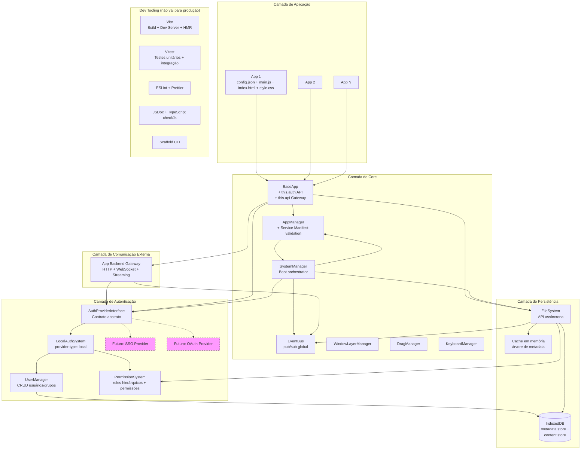
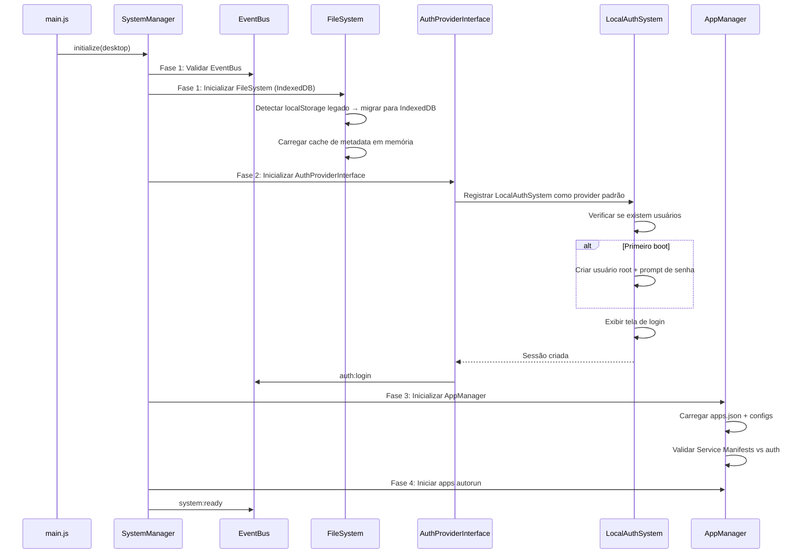
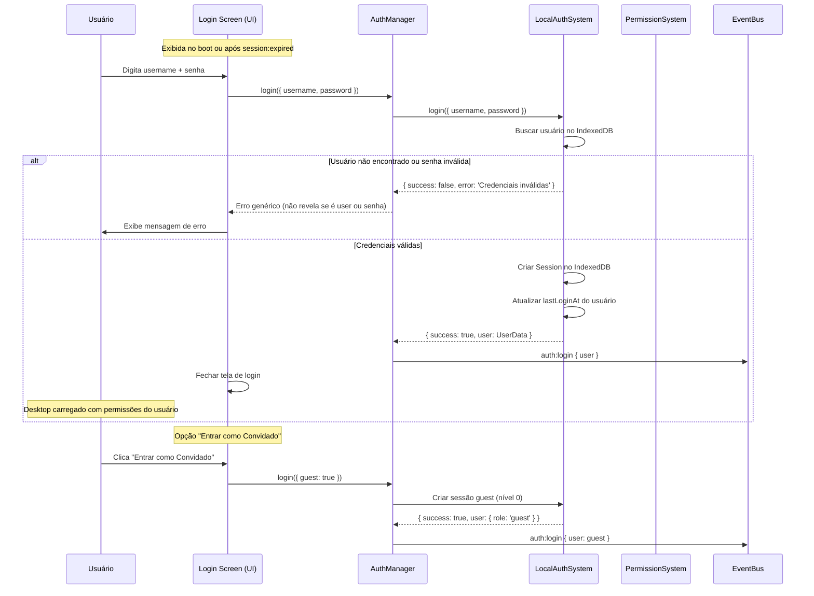
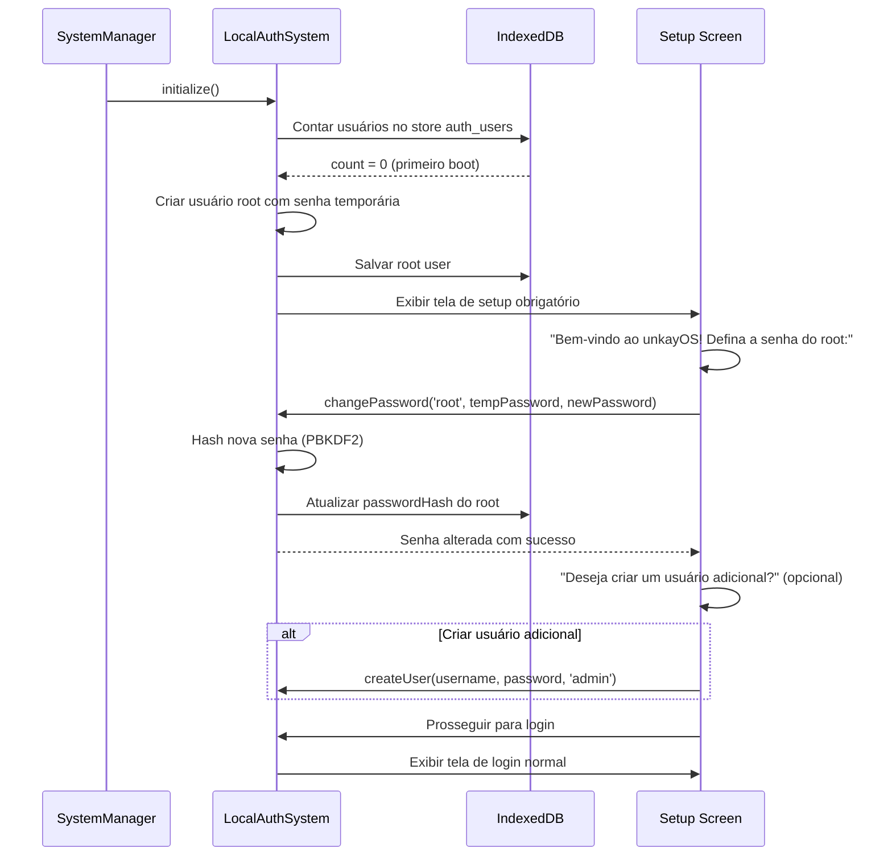
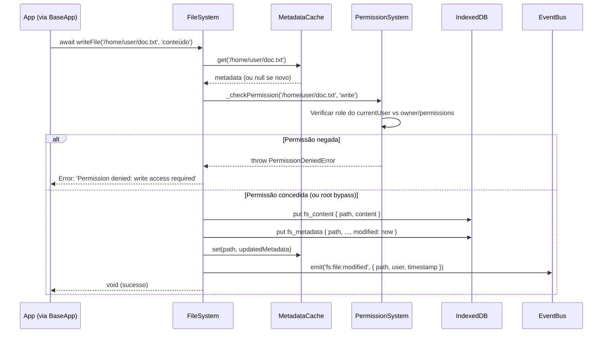
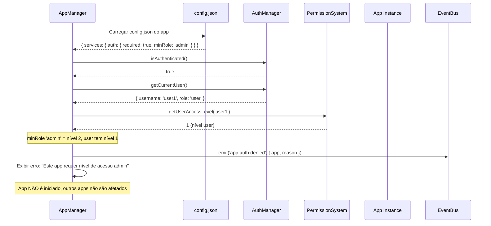
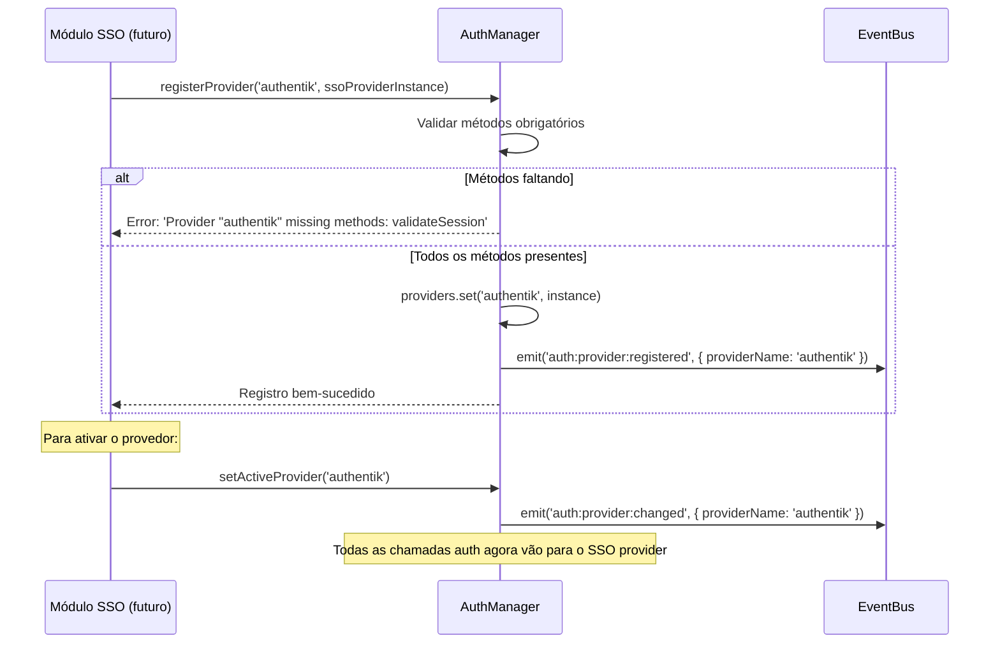

# Documento de Design — Evolução da Stack do unkayOS

## Visão Geral

Este documento descreve o design técnico para evoluir a stack do unkayOS — um sistema operacional web modular construído com vanilla JavaScript e ES modules. A evolução é organizada em **6 fases sequenciais** que garantem progressão gradual sem quebrar o sistema em nenhum estágio:

| Fase | Escopo | Requisitos | Impacto Runtime |
|------|--------|------------|-----------------|
| 1 | Dev Tooling Foundation | 9 → 1 → 2 → 5 → 3 | Zero — apenas infraestrutura de dev |
| 2 | Testing | 4 | Zero — rede de segurança antes de refatorar |
| 3 | FileSystem Refactoring | 7 | Alto — migração sync → async |
| 4 | CSS Isolation + Modularity | 6 → 10 | Médio — isolamento de estilos |
| 5 | Authentication System | 13 → 11 → 12 | Alto — novo sistema de auth local |
| 6 | App Integration + Services | 14 → 15 → 8 | Médio — gateway e scaffold |

**Ordem de implementação:** 9 → 1 → 2 → 5 → 3 → 4 → 7 → 6 → 10 → 13 → 11 → 12 → 14 → 15 → 8

### Princípios de Design

1. **Progressão sem quebra**: Cada fase produz um sistema funcional. Nenhuma fase depende de fases futuras.
2. **Vanilla JS preservado**: Zero dependências de runtime. Frameworks apenas como devDependencies.
3. **Modularidade de apps intacta**: O padrão `config.json + main.js + index.html + style.css + icon.svg` estendendo `BaseApp` permanece inalterado.
4. **Async-first**: A migração do FileSystem para API assíncrona é a mudança mais invasiva e acontece na Fase 3, protegida pelos testes da Fase 2.

---

## Arquitetura

### Diagrama de Arquitetura Geral (Pós-Evolução)



### Sequência de Boot (Pós-Evolução)



---

## Componentes e Interfaces

### Fase 1 — Dev Tooling Foundation

#### package.json (Req 9)

Arquivo raiz do projeto com zero dependências de runtime:

```json
{
  "name": "unkayos",
  "version": "1.0.0",
  "type": "module",
  "scripts": {
    "dev": "vite",
    "build": "vite build",
    "preview": "vite preview",
    "test": "vitest run",
    "test:watch": "vitest",
    "test:coverage": "vitest run --coverage",
    "lint": "eslint .",
    "lint:fix": "eslint . --fix",
    "format": "prettier --write .",
    "format:check": "prettier --check .",
    "scaffold": "node scripts/scaffold-app.mjs",
    "typecheck": "tsc --noEmit"
  },
  "devDependencies": {
    "vite": "^6.x",
    "vitest": "^3.x",
    "eslint": "^9.x",
    "prettier": "^3.x",
    "typescript": "^5.x",
    "@vitest/coverage-v8": "^3.x",
    "happy-dom": "^x.x",
    "fast-check": "^4.x"
  }
}
```

#### Vite Config (Req 1 + Req 2)

```javascript
// vite.config.js
export default {
  root: '.',
  build: {
    outDir: 'dist',
    sourcemap: true,
    rollupOptions: {
      input: {
        main: 'index.html'
      }
    }
  },
  server: {
    // HMR habilitado por padrão
  }
}
```

O Vite serve ES modules nativos em dev (sem bundling) e aplica tree-shaking + minificação no build de produção. A estrutura `apps/{app-name}/` é preservada nos artefatos via configuração de rollup input dinâmico que detecta apps automaticamente.

#### ESLint + Prettier (Req 5)

Configuração flat config do ESLint v9 com regra customizada para detectar `document.querySelector` fora do escopo de BaseApp. Prettier com configuração compartilhada para `.js`, `.css`, `.json`.

#### JSDoc + TypeScript checkJs (Req 3)

```json
// tsconfig.json
{
  "compilerOptions": {
    "allowJs": true,
    "checkJs": true,
    "noEmit": true,
    "strict": false,
    "target": "ES2022",
    "module": "ES2022",
    "moduleResolution": "bundler",
    "lib": ["ES2022", "DOM", "DOM.Iterable"]
  },
  "include": ["core/**/*.js", "apps/**/*.js", "main.js"],
  "exclude": ["node_modules", "dist"]
}
```

Arquivos `.d.ts` serão criados em `core/types/` para as APIs públicas: `BaseApp`, `EventBus`, `SystemManager`, `AppManager`, `FileSystem`.

### Fase 2 — Testing (Req 4)

#### Vitest Config

```javascript
// vitest.config.js
import { defineConfig } from 'vitest/config'

export default defineConfig({
  test: {
    environment: 'happy-dom',
    include: ['tests/**/*.test.js'],
    coverage: {
      provider: 'v8',
      include: ['core/**/*.js']
    }
  }
})
```

Estrutura de testes:
```
tests/
  unit/
    core/
      EventBus.test.js
      FileSystem.test.js
      AppManager.test.js
      BaseApp.test.js
  integration/
    app-lifecycle.test.js
  properties/
    filesystem.property.test.js
    auth.property.test.js
    permissions.property.test.js
```

### Fase 3 — FileSystem Refactoring (Req 7)

#### Interface do FileSystem Assíncrono

```javascript
/**
 * @typedef {Object} FileMetadata
 * @property {'file'|'directory'} type
 * @property {string} name
 * @property {string} parent
 * @property {string[]} [children] — apenas para diretórios
 * @property {string} permissions — formato Unix 'rwxr-xr-x'
 * @property {string} owner
 * @property {string} created — ISO 8601
 * @property {string} modified — ISO 8601
 * @property {number} size
 * @property {string} [mimeType] — para arquivos binários
 */

class FileSystem {
  /** @returns {Promise<void>} */
  async initialize() {}

  /** @returns {Promise<string|ArrayBuffer|Blob>} */
  async readFile(path) {}

  /** @returns {Promise<void>} */
  async writeFile(path, content, options = {}) {}

  /** @returns {Promise<void>} */
  async mkdir(path, options = {}) {}

  /** @returns {Promise<void>} */
  async remove(path, options = {}) {}

  /** @returns {Promise<FileMetadata[]>} */
  async readdir(path = '.') {}

  /** @returns {Promise<FileMetadata>} */
  async stat(path) {}

  /** @returns {Promise<boolean>} */
  async exists(path) {}

  /** @returns {Promise<void>} */
  async move(srcPath, destPath) {}

  /** @returns {Promise<void>} */
  async copy(srcPath, destPath, options = {}) {}

  /** @returns {Promise<Array>} */
  async find(pattern, startPath = '.', options = {}) {}
}
```

#### IndexedDB Schema

Dois object stores separados:

**`fs_metadata`** — Armazena metadata de cada entry (arquivo ou diretório):
- Key: path (string, ex: `/home/user/Documents/welcome.txt`)
- Value: `FileMetadata` object

**`fs_content`** — Armazena conteúdo de arquivos:
- Key: path (string, mesmo key do metadata)
- Value: `string | ArrayBuffer | Blob`

#### Cache em Memória

A árvore de metadata é carregada inteiramente em memória na inicialização. Operações de navegação (`exists`, `stat`, `readdir`) consultam apenas o cache. Operações de escrita atualizam cache + IndexedDB. Leitura de conteúdo de arquivo sempre vai ao IndexedDB.

```javascript
class MetadataCache {
  constructor() {
    /** @type {Map<string, FileMetadata>} */
    this.entries = new Map();
  }

  get(path) { return this.entries.get(path); }
  set(path, metadata) { this.entries.set(path, metadata); }
  delete(path) { this.entries.delete(path); }
  has(path) { return this.entries.has(path); }
  
  /** Carrega toda a metadata do IndexedDB para o cache */
  async loadFromStore(db) { /* ... */ }
}
```

#### Estratégia de Migração localStorage → IndexedDB

1. Na inicialização, `FileSystem.initialize()` verifica se existe a key `unkayOS_filesystem` no localStorage.
2. Se existir, parseia o JSON monolítico e itera sobre cada entry.
3. Para cada entry, grava metadata no store `fs_metadata` e conteúdo (se arquivo) no store `fs_content`.
4. Após migração completa e verificada, remove `unkayOS_filesystem` do localStorage.
5. Se a migração falhar no meio, mantém localStorage intacto e tenta novamente no próximo boot.

#### Eventos de FileSystem

Todos os eventos emitidos via `EventBus` existente:

| Evento | Payload | Quando |
|--------|---------|--------|
| `fs:file:created` | `{ path, user, timestamp }` | `writeFile` em path novo |
| `fs:file:modified` | `{ path, user, timestamp }` | `writeFile` em path existente |
| `fs:file:deleted` | `{ path, user, timestamp }` | `remove` em arquivo |
| `fs:directory:created` | `{ path, user, timestamp }` | `mkdir` |
| `fs:directory:deleted` | `{ path, user, timestamp }` | `remove` em diretório |
| `fs:file:moved` | `{ oldPath, newPath, user, timestamp }` | `move` |
| `fs:file:copied` | `{ srcPath, destPath, user, timestamp }` | `copy` |

#### Enforcement de Permissões (ativado na Fase 5)

O FileSystem recebe uma referência ao `PermissionSystem` via injeção. Antes de cada operação, verifica:

```javascript
async _checkPermission(path, operation) {
  if (!this.permissionSystem) return; // Fase 3: sem enforcement
  
  const currentUser = this.authProvider?.getCurrentUser();
  if (!currentUser) return; // guest mode — permissões relaxadas
  
  // Root bypass
  if (currentUser.role === 'root') return;
  
  const metadata = this.cache.get(path);
  if (!metadata) return;
  
  const perms = this._parsePermissions(metadata.permissions);
  const isOwner = metadata.owner === currentUser.username;
  
  // Verifica owner/group/others conforme operação (read/write/execute)
  // Lança erro se negado
}
```

### Fase 4 — CSS Isolation (Req 6)

#### Estratégia: CSS Scoping via Build Transform

No build de produção, o Vite plugin transforma seletores CSS de cada app adicionando um atributo `data-app-instance` como escopo. Em dev, o `AppWindowSystem` já injeta CSS dentro do container do app — a transformação adiciona o seletor de escopo automaticamente.

Regras:
- Seletores globais (`html`, `body`, `*`) são ignorados (não recebem namespace).
- Custom properties (`:root`, `--token-*`) permanecem acessíveis globalmente.
- Cada instância de app recebe `data-app-instance="{instanceId}"` no container.

### Fase 5 — Authentication System

#### AuthProviderInterface (Req 13)

```javascript
/**
 * Contrato abstrato que todo provedor de autenticação deve implementar.
 * @interface
 */
class AuthProviderInterface {
  // --- Métodos obrigatórios do contrato ---
  
  /** @returns {Promise<{success: boolean, user?: UserData, error?: string}>} */
  async login(credentials) {}
  
  /** @returns {Promise<void>} */
  async logout() {}
  
  /** @returns {boolean} */
  isAuthenticated() {}
  
  /** @returns {UserData|null} */
  getCurrentUser() {}
  
  /** @returns {Promise<boolean>} */
  async validateSession() {}
  
  /** @returns {string} */
  getProviderName() {}
  
  /** @returns {'local'|'sso'|'oauth'} */
  getProviderType() {}
}
```

**Registro e seleção de provedores:**

```javascript
class AuthManager {
  constructor() {
    /** @type {Map<string, AuthProviderInterface>} */
    this.providers = new Map();
    /** @type {string|null} */
    this.activeProviderName = null;
  }

  registerProvider(providerName, providerInstance) {
    // Valida que implementa todos os métodos obrigatórios
    const required = ['login','logout','isAuthenticated','getCurrentUser',
                      'validateSession','getProviderName','getProviderType'];
    const missing = required.filter(m => typeof providerInstance[m] !== 'function');
    if (missing.length > 0) {
      throw new Error(`Provider "${providerName}" missing methods: ${missing.join(', ')}`);
    }
    this.providers.set(providerName, providerInstance);
    eventBus.emit('auth:provider:registered', { providerName });
  }

  setActiveProvider(providerName) {
    if (!this.providers.has(providerName)) throw new Error(`Provider "${providerName}" not found`);
    this.activeProviderName = providerName;
    eventBus.emit('auth:provider:changed', { providerName });
  }

  getActiveProvider() {
    return this.providers.get(this.activeProviderName);
  }

  getAvailableProviders() {
    return [...this.providers.entries()].map(([name, p]) => ({
      name,
      type: p.getProviderType(),
      active: name === this.activeProviderName
    }));
  }

  // Proxy methods para o provider ativo
  async login(credentials) { return this.getActiveProvider().login(credentials); }
  async logout() { return this.getActiveProvider().logout(); }
  isAuthenticated() { return this.getActiveProvider().isAuthenticated(); }
  getCurrentUser() { return this.getActiveProvider().getCurrentUser(); }
}
```

#### LocalAuthSystem (Req 11)

Implementa `AuthProviderInterface` com tipo `"local"`. Armazena dados em IndexedDB (store `auth_users` e `auth_sessions`).

**Hashing de senhas via Web Crypto API (PBKDF2):**

```javascript
async function hashPassword(password, salt = null) {
  salt = salt || crypto.getRandomValues(new Uint8Array(16));
  const encoder = new TextEncoder();
  const keyMaterial = await crypto.subtle.importKey(
    'raw', encoder.encode(password), 'PBKDF2', false, ['deriveBits']
  );
  const hash = await crypto.subtle.deriveBits(
    { name: 'PBKDF2', salt, iterations: 100000, hash: 'SHA-256' },
    keyMaterial, 256
  );
  return { hash: new Uint8Array(hash), salt };
}

async function verifyPassword(password, storedHash, storedSalt) {
  const { hash } = await hashPassword(password, storedSalt);
  return hash.every((byte, i) => byte === storedHash[i]);
}
```

**Primeiro boot:** Cria usuário `root` com senha padrão temporária e exibe prompt obrigatório para redefinição.

**Modo guest:** Sessão com permissões restritas (nível 0), sem necessidade de login.

#### UserManager (Req 12)

```javascript
class UserManager {
  async createUser(username, password, role = 'user') {}
  async deleteUser(username) {}
  async updateUser(username, fields) {}
  async getUser(username) {}
  async listUsers() {}
  async changePassword(username, oldPassword, newPassword) {}
  async createGroup(groupName, permissions) {}
  async addUserToGroup(username, groupName) {}
  async removeUserFromGroup(username, groupName) {}
}
```

#### PermissionSystem (Req 12)

Roles hierárquicos:

| Role | Nível | Descrição |
|------|-------|-----------|
| guest | 0 | Acesso mínimo, sem login |
| user | 1 | Usuário padrão |
| admin | 2 | Administrador |
| root | 3 | Acesso total, bypass de permissões |

Permissões granulares: `system:shutdown`, `system:settings`, `apps:install`, `apps:uninstall`, `files:read`, `files:write`, `files:delete`, `users:manage`, `users:create`, `users:delete`.

```javascript
class PermissionSystem {
  hasPermission(username, permission) {}
  hasRole(username, role) {}
  getUserAccessLevel(username) {}
  canExecute(username, action) {}
}
```

### Fase 6 — App Integration + Services

#### App Backend Gateway (Req 14)

Exposto na BaseApp como `this.api`:

```javascript
class AppBackendGateway {
  constructor(instanceId, authManager) {
    this.instanceId = instanceId;
    this.authManager = authManager;
    this.pendingRequests = new Set();
    this.webSockets = new Set();
  }

  async get(url, options = {}) {}
  async post(url, body, options = {}) {}
  async put(url, body, options = {}) {}
  async delete(url, options = {}) {}
  
  /** Conexão WebSocket com reconexão automática */
  connectWebSocket(url, options = {}) {}
  
  /** Streaming de respostas (ReadableStream) */
  async stream(url, options = {}) {}
  
  /** Cleanup automático no onCleanup do app */
  destroy() {
    this.pendingRequests.forEach(ctrl => ctrl.abort());
    this.webSockets.forEach(ws => ws.close());
  }
}
```

Funcionalidades:
- **Auto-auth**: Injeta `Authorization: Bearer <token>` automaticamente se o provider ativo tiver sessão.
- **Retry com backoff exponencial**: Padrão 3 tentativas para erros 5xx e timeout.
- **401 handling**: Solicita revalidação de sessão ao AuthManager antes de propagar erro.
- **Streaming**: Suporte a `ReadableStream` para APIs de IA.

#### Service Manifest (Req 15)

Extensão do `config.json`:

```json
{
  "app_name": "AI Chat",
  "services": {
    "auth": {
      "required": true,
      "minRole": "user",
      "permissions": ["files:read", "files:write"]
    },
    "api": [
      {
        "name": "main-api",
        "baseUrl": "https://api.example.com",
        "type": "rest",
        "authProvider": "local"
      }
    ],
    "ai": {
      "provider": "openai",
      "model": "gpt-4",
      "baseUrl": "https://api.openai.com/v1",
      "authProvider": "local"
    }
  }
}
```

O `AppManager` valida o manifesto antes de iniciar o app. Apps sem seção `services` continuam funcionando normalmente (retrocompatibilidade).

#### Scaffold CLI (Req 8)

```bash
node scripts/scaffold-app.mjs my-app --mode system_window --with-auth user --with-api
```

Gera: `apps/my-app/` com `config.json`, `main.js` (extends BaseApp), `index.html`, `style.css`, `icon.svg`. Registra automaticamente em `apps/apps.json`.

---

## Modelos de Dados

### FileSystem — IndexedDB Stores

#### Store: `fs_metadata`

```javascript
/** @typedef {Object} FSMetadataEntry */
{
  path: '/home/user/Documents/welcome.txt',  // keyPath
  type: 'file',                               // 'file' | 'directory'
  name: 'welcome.txt',
  parent: '/home/user/Documents',
  children: undefined,                        // apenas para diretórios: string[]
  permissions: 'rw-rw-r--',                  // formato Unix
  owner: 'user',
  created: '2025-01-01T00:00:00.000Z',
  modified: '2025-01-15T10:30:00.000Z',
  size: 700,
  mimeType: undefined                         // apenas para binários: 'image/png', etc.
}
```

#### Store: `fs_content`

```javascript
/** @typedef {Object} FSContentEntry */
{
  path: '/home/user/Documents/welcome.txt',  // keyPath
  content: 'Bem-vindo ao UnkayOS!...'        // string | ArrayBuffer | Blob
}
```

### Auth — IndexedDB Stores

#### Store: `auth_users`

```javascript
/** @typedef {Object} UserRecord */
{
  uid: 1,                                     // autoIncrement
  username: 'admin',                          // unique index, case-insensitive
  passwordHash: Uint8Array,                   // PBKDF2 hash
  passwordSalt: Uint8Array,                   // salt aleatório
  role: 'admin',                              // 'guest' | 'user' | 'admin' | 'root'
  groups: ['administrators', 'developers'],
  displayName: 'Administrador',
  createdAt: '2025-01-01T00:00:00.000Z',
  lastLoginAt: '2025-01-15T10:30:00.000Z',
  isActive: true
}
```

#### Store: `auth_sessions`

```javascript
/** @typedef {Object} SessionRecord */
{
  sessionId: 'uuid-v4-string',               // keyPath
  userId: 1,                                  // referência ao uid
  username: 'admin',
  role: 'admin',
  createdAt: '2025-01-15T10:30:00.000Z',
  expiresAt: '2025-01-15T11:30:00.000Z',     // configurável
  isValid: true
}
```

#### Store: `auth_groups`

```javascript
/** @typedef {Object} GroupRecord */
{
  name: 'administrators',                     // keyPath
  permissions: ['users:manage', 'system:settings', 'apps:install'],
  members: ['admin', 'root'],
  createdAt: '2025-01-01T00:00:00.000Z'
}
```

### Service Manifest Schema

```javascript
/** @typedef {Object} ServiceManifest */
{
  auth: {
    required: true,                           // boolean
    minRole: 'user',                          // 'guest' | 'user' | 'admin' | 'root'
    permissions: ['files:read']               // string[]
  },
  api: [{
    name: 'main-api',                         // identificador
    baseUrl: 'https://api.example.com',
    type: 'rest',                             // 'rest' | 'websocket'
    authProvider: 'local'                     // referência ao provider
  }],
  ai: {
    provider: 'openai',                       // 'openai' | 'anthropic' | 'custom'
    model: 'gpt-4',
    baseUrl: 'https://api.openai.com/v1',
    authProvider: 'local'
  }
}
```

---

## Estratégias de Migração e Compatibilidade

### Migração de Apps Existentes para API Assíncrona (Fase 3)

A mudança de API síncrona para assíncrona no FileSystem é a mais invasiva. Estratégia de migração:

1. **Wrapper de compatibilidade temporário**: Durante a transição, o FileSystem expõe tanto métodos sync (legado, com warning no console) quanto async (novos). Os métodos sync internamente chamam os async com um cache síncrono como fallback.

2. **Migração app por app**: Cada app é atualizado individualmente para usar `await` nas chamadas ao FileSystem. A ordem de migração segue a criticidade:
   - Terminal (usa FileSystem intensivamente — filesystem-commands.js)
   - File Manager (CRUD de arquivos)
   - Text Editor (readFile/writeFile)
   - Demais apps (uso esporádico)

3. **Padrão de migração por método**:

```javascript
// ANTES (síncrono)
const content = this.fileSystem.readFile('/home/user/file.txt');

// DEPOIS (assíncrono)
const content = await this.fileSystem.readFile('/home/user/file.txt');
```

4. **Impacto nos métodos de BaseApp**: Os métodos `onRun()` e `onCleanup()` dos apps já podem ser async (BaseApp os chama com `await`). Portanto, adicionar `await` dentro deles não quebra a interface.

5. **Remoção do wrapper legado**: Após todos os apps serem migrados, o wrapper de compatibilidade síncrono é removido e os métodos sync são deprecados.

### Migração do AuthSystem Existente (Fase 5)

O `AuthSystem.js` atual (Authentik-specific) será substituído gradualmente:

1. **Fase 5a**: Criar `AuthManager`, `AuthProviderInterface`, `LocalAuthSystem`, `UserManager`, `PermissionSystem` como novos arquivos no core.
2. **Fase 5b**: O `SystemManager` passa a inicializar o `AuthManager` em vez do `AuthSystem` antigo.
3. **Fase 5c**: A API pública na BaseApp (`this.auth`) é conectada ao `AuthManager` em vez do `AuthSystem.getAPI()`.
4. **Fase 5d**: O `AuthSystem.js` antigo e `auth-config.js` são removidos. O `auth/callback.html` é mantido como scaffold para futuros provedores OAuth.

### Retrocompatibilidade de Apps sem Services (Fase 6)

Apps existentes que não declaram seção `services` no `config.json` continuam funcionando sem alteração. O `AppManager` trata a ausência de `services` como "app client-side puro, sem requisitos de auth ou backend".

---

## Detalhes de Implementação

### Vite Plugin para CSS Scoping (Fase 4)

```javascript
// vite-plugin-css-scope.mjs
export function cssScopePlugin() {
  return {
    name: 'unkayos-css-scope',
    transform(code, id) {
      // Apenas arquivos CSS dentro de apps/
      if (!id.includes('/apps/') || !id.endsWith('.css')) return;

      const appName = id.match(/apps\/([^/]+)\//)?.[1];
      if (!appName) return;

      // Ignora seletores globais e custom properties
      const globalSelectors = ['html', 'body', '*', ':root'];
      
      // Adiciona [data-app-instance] como escopo a cada regra
      const scoped = code.replace(
        /([^{}@]+)\{/g,
        (match, selector) => {
          const trimmed = selector.trim();
          if (globalSelectors.some(g => trimmed.startsWith(g))) return match;
          if (trimmed.startsWith('@')) return match;
          if (trimmed.startsWith(':root')) return match;
          return `[data-app-id="${appName}"] ${trimmed} {`;
        }
      );
      return { code: scoped, map: null };
    }
  };
}
```

Em modo de desenvolvimento, o CSS scoping é aplicado em runtime pelo `AppWindowSystem` ao injetar o CSS no container do app. O plugin Vite aplica a transformação apenas no build de produção.

### HMR por App (Fase 1)

O Vite HMR funciona nativamente com ES modules. Para o unkayOS, o comportamento específico é:

- **Arquivos .js de app**: O Vite detecta a mudança e recarrega o módulo. O `AppManager` recebe o módulo atualizado e re-executa `onRun()` da instância afetada, preservando o estado das outras janelas.
- **Arquivos .css de app**: O Vite injeta o CSS atualizado via `<style>` tag sem recarregar a página. O CSS scoping garante que apenas a instância do app é afetada.
- **Arquivos index.html de app**: Trigger de full reload apenas da instância do app (via `AppWindowSystem.reloadInstance(instanceId)`).
- **Arquivos do core**: Full page reload como fallback, pois mudanças no core afetam todo o sistema.

### Integração do Auth com BaseApp (Fase 5)

A BaseApp expõe `this.auth` como proxy para o `AuthManager`:

```javascript
// Em BaseApp.constructor() ou no momento de injeção pelo AppManager
class BaseApp {
  constructor(config, systems) {
    // ... existing code ...
    
    // Auth API — proxy para AuthManager
    this.auth = {
      isAuthenticated: () => systems.authManager.isAuthenticated(),
      getCurrentUser: () => systems.authManager.getCurrentUser(),
      hasPermission: (perm) => systems.permissionSystem.hasPermission(
        systems.authManager.getCurrentUser()?.username, perm
      ),
      hasRole: (role) => systems.permissionSystem.hasRole(
        systems.authManager.getCurrentUser()?.username, role
      ),
      getAccessLevel: () => systems.permissionSystem.getUserAccessLevel(
        systems.authManager.getCurrentUser()?.username
      ),
      on: (event, cb) => systems.eventBus.on(`auth:${event}`, cb),
      off: (event, cb) => systems.eventBus.off(`auth:${event}`, cb)
    };
  }
}
```

### Fluxo de Login e Tela de Login (Fase 5)



### Fluxo de Primeiro Boot (Fase 5)



### Retry com Backoff Exponencial — App Backend Gateway (Fase 6)

```javascript
async _fetchWithRetry(url, options, maxRetries = 3) {
  let lastError;
  for (let attempt = 0; attempt <= maxRetries; attempt++) {
    try {
      const controller = new AbortController();
      this.pendingRequests.add(controller);
      
      const response = await fetch(url, {
        ...options,
        signal: controller.signal
      });
      
      this.pendingRequests.delete(controller);
      
      // 401 — tenta revalidar sessão uma vez
      if (response.status === 401 && attempt === 0) {
        const revalidated = await this.authManager.getActiveProvider().validateSession();
        if (revalidated) continue; // retry com sessão renovada
      }
      
      // 5xx — retry com backoff
      if (response.status >= 500 && attempt < maxRetries) {
        const delay = Math.pow(2, attempt) * 1000; // 1s, 2s, 4s
        await new Promise(r => setTimeout(r, delay));
        continue;
      }
      
      return response;
    } catch (error) {
      this.pendingRequests.delete(controller);
      lastError = error;
      
      if (error.name === 'AbortError') throw error; // não retry em abort
      
      if (attempt < maxRetries) {
        const delay = Math.pow(2, attempt) * 1000;
        await new Promise(r => setTimeout(r, delay));
      }
    }
  }
  throw lastError;
}
```

### WebSocket com Reconexão Automática — App Backend Gateway (Fase 6)

```javascript
connectWebSocket(url, options = {}) {
  const { maxReconnectAttempts = 5, reconnectDelay = 1000 } = options;
  let reconnectAttempts = 0;
  let ws;

  const connect = () => {
    ws = new WebSocket(url);
    this.webSockets.add(ws);

    ws.onopen = () => {
      reconnectAttempts = 0;
      eventBus.emit('api:websocket:connected', { url, instanceId: this.instanceId });
      options.onOpen?.(ws);
    };

    ws.onmessage = (event) => options.onMessage?.(event.data);

    ws.onclose = (event) => {
      this.webSockets.delete(ws);
      eventBus.emit('api:websocket:disconnected', { url, instanceId: this.instanceId, code: event.code });
      
      if (!event.wasClean && reconnectAttempts < maxReconnectAttempts) {
        reconnectAttempts++;
        const delay = reconnectDelay * Math.pow(2, reconnectAttempts - 1);
        setTimeout(connect, delay);
      }
      options.onClose?.(event);
    };

    ws.onerror = (error) => options.onError?.(error);
  };

  connect();
  return {
    send: (data) => ws?.send(data),
    close: () => { reconnectAttempts = maxReconnectAttempts; ws?.close(); }
  };
}
```

### Scaffold CLI — Templates Completos (Fase 6)

O script `scripts/scaffold-app.mjs` gera os seguintes arquivos:

**config.json template:**
```json
{
  "app_name": "{app-name}",
  "display_name": "{App Name}",
  "mode": "{mode}",
  "width": 800,
  "height": 600,
  "min_width": 400,
  "min_height": 300,
  "resizable": true,
  "icon": "apps/{app-name}/icon.svg",
  "main": "apps/{app-name}/main.js",
  "html": "apps/{app-name}/index.html",
  "style": "apps/{app-name}/style.css"
}
```

**config.json template com services (--with-auth, --with-api):**
```json
{
  "app_name": "{app-name}",
  "display_name": "{App Name}",
  "mode": "{mode}",
  "width": 800,
  "height": 600,
  "min_width": 400,
  "min_height": 300,
  "resizable": true,
  "icon": "apps/{app-name}/icon.svg",
  "main": "apps/{app-name}/main.js",
  "html": "apps/{app-name}/index.html",
  "style": "apps/{app-name}/style.css",
  "services": {
    "auth": {
      "required": true,
      "minRole": "{role}",
      "permissions": []
    },
    "api": [
      {
        "name": "main-api",
        "baseUrl": "https://api.example.com",
        "type": "rest",
        "authProvider": "local"
      }
    ]
  }
}
```

**main.js template:**
```javascript
import { BaseApp } from '../../core/BaseApp.js';

export default class {AppClassName} extends BaseApp {
  async onRun() {
    // Inicialização do app
    const container = this.$('.app-content');
    if (container) {
      container.textContent = 'Hello from {App Name}!';
    }
  }

  async onCleanup() {
    // Limpeza ao fechar o app
  }
}
```

**index.html template:**
```html
<div class="{app-name}-app">
  <div class="app-content"></div>
</div>
```

**style.css template:**
```css
@import '../../design-system/styles/main.css';

.{app-name}-app {
  width: 100%;
  height: 100%;
  display: flex;
  flex-direction: column;
  background: var(--color-surface);
  color: var(--color-on-surface);
}

.{app-name}-app .app-content {
  flex: 1;
  padding: var(--spacing-md);
  overflow: auto;
}
```

**Registro automático em apps.json:**
O scaffold lê `apps/apps.json`, adiciona o novo app ao array, e salva o arquivo atualizado.

---

## Fluxos de Interação Detalhados

### Fluxo: App Acessando FileSystem com Permissões (Fase 3 + 5)



### Fluxo: App com Service Manifest sendo Carregado (Fase 6)



### Fluxo: Registro de Provedor Externo Futuro (Fase 5 — scaffold)



---

## Estrutura de Arquivos (Pós-Evolução)

```
unkayOS/
├── package.json                    # Fase 1 — devDependencies, scripts
├── vite.config.js                  # Fase 1 — build + dev server
├── vitest.config.js                # Fase 2 — configuração de testes
├── tsconfig.json                   # Fase 1 — JSDoc type checking
├── eslint.config.js                # Fase 1 — flat config ESLint v9
├── .prettierrc                     # Fase 1 — configuração Prettier
├── .gitignore                      # Fase 1 — node_modules, dist
├── index.html                      # Existente
├── main.js                         # Existente
├── scripts/
│   └── scaffold-app.mjs            # Fase 6 — CLI de scaffold
├── core/
│   ├── AppCore.js                  # Existente
│   ├── AppCustomUI.js              # Existente
│   ├── AppManager.js               # Atualizado Fase 6 — Service Manifest validation
│   ├── AppWindowSystem.js          # Atualizado Fase 4 — CSS scoping runtime
│   ├── AuthManager.js              # NOVO Fase 5 — orquestrador de providers
│   ├── AuthProviderInterface.js    # NOVO Fase 5 — contrato abstrato
│   ├── LocalAuthSystem.js          # NOVO Fase 5 — provider local
│   ├── UserManager.js              # NOVO Fase 5 — CRUD usuários/grupos
│   ├── PermissionSystem.js         # NOVO Fase 5 — roles + permissões
│   ├── AppBackendGateway.js        # NOVO Fase 6 — HTTP/WS/streaming
│   ├── BaseApp.js                  # Atualizado Fase 5+6 — this.auth + this.api
│   ├── DragManager.js              # Existente
│   ├── eventBus.js                 # Existente
│   ├── FileSystem.js               # Refatorado Fase 3 — async + IndexedDB
│   ├── IndexedDBStore.js           # NOVO Fase 3 — wrapper IndexedDB
│   ├── MetadataCache.js            # NOVO Fase 3 — cache em memória
│   ├── KeyboardManager.js          # Existente
│   ├── LazyResourceLoader.js       # Existente
│   ├── LoadingManager.js           # Existente
│   ├── LoadingUI.js                # Existente
│   ├── MenuApps.js                 # Existente
│   ├── PositionManager.js          # Existente
│   ├── SystemManager.js            # Atualizado Fase 5 — boot com auth
│   ├── WindowLayerManager.js       # Existente
│   ├── configs/
│   │   └── auth-config.js          # REMOVIDO Fase 5 (Authentik-specific)
│   ├── types/                      # NOVO Fase 1
│   │   ├── BaseApp.d.ts
│   │   ├── EventBus.d.ts
│   │   ├── FileSystem.d.ts
│   │   ├── AppManager.d.ts
│   │   └── SystemManager.d.ts
│   └── utils/
│       ├── generateCodeVerifier.js # Existente (mantido para futuro OAuth)
│       ├── generateUniqueId.js     # Existente
│       ├── loadJSON.js             # Existente
│       ├── pxToViewport.js         # Existente
│       ├── realFileMapper.js       # Existente
│       └── passwordHash.js         # NOVO Fase 5 — PBKDF2 utils
├── auth/
│   └── callback.html               # Existente (mantido como scaffold)
├── tests/                          # NOVO Fase 2
│   ├── unit/
│   │   └── core/
│   │       ├── EventBus.test.js
│   │       ├── FileSystem.test.js
│   │       ├── AppManager.test.js
│   │       ├── BaseApp.test.js
│   │       ├── AuthManager.test.js
│   │       ├── LocalAuthSystem.test.js
│   │       ├── UserManager.test.js
│   │       └── PermissionSystem.test.js
│   ├── integration/
│   │   ├── app-lifecycle.test.js
│   │   └── auth-flow.test.js
│   └── properties/
│       ├── filesystem.property.test.js
│       ├── auth.property.test.js
│       └── permissions.property.test.js
├── apps/                           # Existente — estrutura preservada
│   ├── apps.json
│   ├── browser/
│   ├── clock/
│   ├── file-manager/
│   ├── process-manager/
│   ├── system-info/
│   ├── taskbar/
│   ├── terminal/
│   └── text-editor/
├── assets/                         # Existente
├── design-system/                  # Existente
└── docs/                           # Existente
```

---

## Propriedades de Corretude (Correctness Properties)

Propriedades formais que devem ser validadas via property-based testing (fast-check):

### FileSystem Properties (Fase 3)

| ID | Propriedade | Descrição |
|----|-------------|-----------|
| FS-P1 | Round-trip (string) | `∀ path, content: string → writeFile(path, content) then readFile(path) === content` |
| FS-P2 | Round-trip (binário) | `∀ path, content: ArrayBuffer → writeFile(path, content) then readFile(path) ≡ content` |
| FS-P3 | mkdir + readdir | `∀ parent, name → mkdir(parent/name) then name ∈ readdir(parent)` |
| FS-P4 | remove + exists | `∀ path existente → remove(path) then exists(path) === false` |
| FS-P5 | Idempotência de mkdir | `∀ path → mkdir(path, {recursive:true}) twice não lança erro` |
| FS-P6 | move preserva conteúdo | `∀ src, dest, content → writeFile(src, content); move(src, dest) then readFile(dest) === content ∧ exists(src) === false` |
| FS-P7 | copy preserva conteúdo | `∀ src, dest, content → writeFile(src, content); copy(src, dest) then readFile(dest) === content ∧ readFile(src) === content` |

### Auth Properties (Fase 5)

| ID | Propriedade | Descrição |
|----|-------------|-----------|
| AUTH-P1 | Hash round-trip | `∀ password → hash(password) then verify(password, hash) === true` |
| AUTH-P2 | Hash diferença | `∀ p1 ≠ p2 → hash(p1) then verify(p2, hash) === false` (com alta probabilidade) |
| AUTH-P3 | Login/logout cycle | `∀ user válido → login(user) then isAuthenticated() === true; logout() then isAuthenticated() === false` |
| AUTH-P4 | Session expiry | `∀ session com expiresAt no passado → validateSession() === false` |

### Permission Properties (Fase 5)

| ID | Propriedade | Descrição |
|----|-------------|-----------|
| PERM-P1 | Hierarquia de roles | `∀ action com minRole=N, user com role nível M → M ≥ N ⟹ canExecute === true` |
| PERM-P2 | Root bypass | `∀ action, user com role='root' → canExecute === true` |
| PERM-P3 | Guest restrição | `∀ action com minRole > 0, user guest → canExecute === false` |
| PERM-P4 | Group herança | `∀ user ∈ group com permission P → hasPermission(user, P) === true` |
| PERM-P5 | Root não deletável | `∀ tentativa → deleteUser('root') lança erro` |

### Gateway Properties (Fase 6)

| ID | Propriedade | Descrição |
|----|-------------|-----------|
| GW-P1 | Cleanup completo | `∀ gateway.destroy() → pendingRequests.size === 0 ∧ webSockets.size === 0` |
| GW-P2 | Retry bounded | `∀ request com maxRetries=N → no máximo N+1 tentativas são feitas` |

---

## Decisões de Design e Trade-offs

### Por que IndexedDB em vez de OPFS (Origin Private File System)?

OPFS seria mais "file system-like", mas tem suporte limitado em alguns browsers e requer Web Workers para acesso síncrono. IndexedDB é universalmente suportado, permite armazenamento de blobs nativamente, e a API assíncrona é suficiente para o caso de uso do unkayOS.

### Por que PBKDF2 em vez de bcrypt/scrypt?

PBKDF2 está disponível nativamente na Web Crypto API (`crypto.subtle`), sem necessidade de bibliotecas externas. Isso mantém a filosofia de zero dependências de runtime. 100.000 iterações com SHA-256 fornece segurança adequada para autenticação local.

### Por que cache de metadata em memória?

O filesystem virtual do unkayOS não terá milhões de arquivos — o cache em memória é viável e elimina a latência do IndexedDB para operações de navegação (exists, stat, readdir). O trade-off é uso de memória, mas para o volume esperado (~centenas a poucos milhares de entries) é negligível.

### Por que não Shadow DOM para CSS isolation?

Shadow DOM criaria uma barreira de encapsulamento que impediria apps de acessar design tokens globais (custom properties em :root) sem workarounds. A abordagem de CSS scoping via atributo `data-app-instance` é mais flexível e mantém compatibilidade com os estilos existentes.

### Por que AuthManager separado do LocalAuthSystem?

O AuthManager é o orquestrador que gerencia múltiplos providers. O LocalAuthSystem é apenas um provider. Essa separação permite que futuros providers (SSO, OAuth) sejam registrados sem tocar no AuthManager ou no LocalAuthSystem — apenas implementam a interface e se registram.
